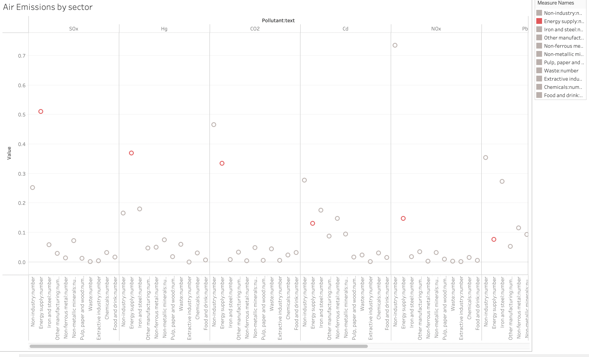
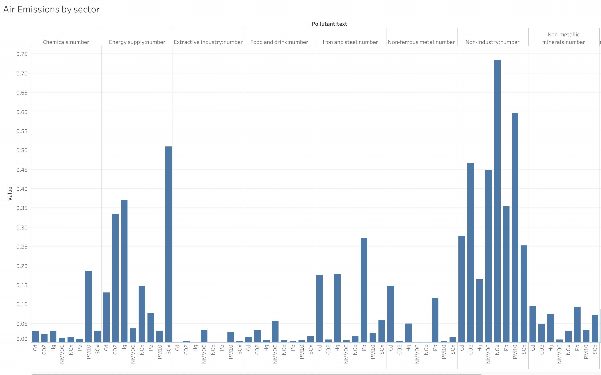

| [home page](https://mahnoorayub.github.io/Mahnoor-Portfolio/) | [visualizing debt](visualizing-government-debt) | [critique by design](critique-by-design) | [final project I](final-project-part-one) | [final project II](final-project-part-two) | [final project III](final-project-part-three) |

# Assignment 3/4 - Critique by design

## Step 1: find a data visualization (with data you can use!)

Source: European Environment Agency - https://www.eea.europa.eu/data-and-maps/daviz/air-emissions-as-a-percentage-3#tab-chart_3

Notes: 
EEA-33 refers to the 33 member countries of the European Environment Agency including the EU-28 Member States, the four European Free Trade Agreement countries (Iceland, Liechtenstein, Norway and Switzerland) as well as Turkey. 
The dataset does not contain data for Turkey and Norway.
The data shows Air emissions for 8 polutants as a percentage of total EEA-33 pollutant emissions in 2017, by sector

#### Why did I choose this visualization? 

Air pollution has been a major concern in my country (Pakistan) in the past few years. We have consistently had poor air quality especially in the big cities and the phenomenon of "smog" has become a common occurence for my city Lahore. This year in particular Pakistan faced a climate catastrophe with the 2022 Floods which left almost one third of the country submerged in water. While a lot needs to be done in Pakistan to counter the climate change, Pakistan contributes less than 1% in global emissions and yet it is one of the countries most at risk due to climate change and global heating. While I would've liked to use something more relevant to Pakistan, this visualization caught my attention where the European Environment Agency is trying to play a role to counter the climate challenges and highlighting important environmental data around pollutants through their many visualizations available on their website. It would be useful for Pakistan as well to have effective policy making based on data to reduce the climate catastrophes in the future. 

## Step 2: critique the data visualization

The visualization is showing relevant information in terms of the air emissions for EEA-33 by each sector, however there is too much colour and poor perceptibility, engagement and intuitiveness. The aesthetics can be greatly improved to give the readers a better understanding. 

### What worked in this visualization?

The visualization does a good job of showing all different air emission pollutants and uses a stacked bar chart to show the percentage contributed by each source. The good thing was you can get a quick idea of which sectors are producing the highest levels of emissions. 

The heading, legend and notes provide relevant information needed to interpret the chart. 

The chart uses a concise format to represent a lot of information. It is showing 8 different pollutants and percentages from 11 different sources. Such a chart has great usefulness for several environment control purposes. 

While the chart might be hard to interpret just by looking at it, if you hover over a single bar, it gives the breakdown of numbers from each source thus increasing the usability of the chart. 

### What didn’t work in this visualization?

The chart is using a lot of distracting colors, with some sources having similar colors thus reducing the aethetics. 

While it might be easy to compare the larger chunks of color, it is hard to compare the sources that are contributing less. 

The perceptibility and intuitiveness are low as it took me sometime to understand that the chart is showing total 100% emissions and then what percentage of each emission is coming from a particular source. While this is written in the heading, the reader can get lost in the information while looking at the chart. 
The x-axis shows percentages but when you hover over the graph it shows the same numbers as decimals which further adds to the confusion. The x-axis also shows 110% which is misleading and unnecessary (seems to be just a designing error). 

It is also hard to compare a single industry and see how much pollution it is causing. There is a lot of eye travel required in the chart and you constantly have to keep the colors for each sector in mind. 

The way the information is presented in terms of percentages also makes it hard to compare the pollutants with one another as it is showing the total 100% of the emissions of that pollutant but not the actual amount that is released. For example, from this chart you cannot tell whether there are greater emissions for CO2 or SOx which is critical information for the audience looking at this topic and thus reduces completeness and usefulness.

### What I would want to do differently?

-	I would want to use a grid a of bar charts (or pie charts or bubble charts) to show each pollutant separately, so it is easier to understand and compare. 
-	I would want to give a message out of this chart that is obvious in the heading for example “Energy Sector is the highest source of air emissions for most pollutants”. Through this I would keep the other low emission causing sectors greyed out and highlight this particular sector. This would also reduce the distracting colors in the chart and make it more appealing to the eye.
-	I would keep the numbers consistent, either use decimals or percentages.
-	If the data was available, instead of showing total 100% I would show the amounts of emissions caused by each sector and then the total emissions for the pollutant. This would make it easier to compare the individual sectors and pollutants with one another.

## Step three: sketch out a solution

Keeping the things mentioned in the previous section in mind, I made the following sketch for a possible redesign. 

Here I have used a grid of bar charts, with emphasis on the energy sector(in red) as it is the source contributing to major chunk of pollutnats. I have kept the all other industries in grey colour to reduce the distracting colours. The non-industry sector is technically the highest contributor but I have also removed emphasis from that so we can focus primarily on the industry sectors as that is what this chart is trying to compare. 

The grid of bar charts works better than the stacked bar charts in the original visualization as you can see all components separately making it easier to compare. 

I tried some other possible ways of visualizing this data as shown below (these are rough visualizations with no proper styling or formating). 

#### Side-side circles
Instead of bars I had thought of using circles as a possible visualization. It was able to highligh which sector contributes the most for each pollutant (and i could highlight the energy sector with red colour). However they were hard to compare with one another and did not seem to be the best option. This chart again would be ranked low in terms of perceptibility. completeness and intuitivness

#### Grid of bar-charts with axis inversed.
This option I tried to see if I could group together the data for each sector instead of grouping together for each pollutant. This was able to show which pollutant each sector is the highest contributor for. But again here the problem was that the data is given in percentages. If the data was in the total amounts of emiisions then this could have been a good option to compare how much of each pollutant a specific sector is responsible for. The percentages in the data are a percentage of that pollutants total emissions and not a percentage of that sectors total pollution hence this was not a good option. 

#### Grid of pie-charts
Lastly I also tried to check what a grid of pie-charts could look like. In this current visualization I have not yet done all the formatting but made a rough structure. I realized this was not very different from the original visualization in terms of the intuitiveness and engagement and does not enhance the usuability of the data so I ignored this option as well. 

After comparing all the possible options I thought that the grid of bar charts was the most appropriate option, so I used that for the next step. 

## Step four: Test the solution

I tested my sketch with two different people who are not a part of the course to get some feedback on my sketch. I asked both of them the same questions (see below) and at the end showed them the original visualization as well. 

They gave the following responses 

#### Person 1 (mid- 20's, student)
Q. Can you tell me what you think this is?

Answer. Seems like a visualization for pollutant emissions for different industries.

Q. Can you describe to me what this is telling you?

Answer. That energy supply is the industry that contributes the most to air pollution in comparison to all other industries.

Q. Is there anything you find surprising or confusing?

Answer. I am confused by what all is included in non-industry that makes it the biggest contributor of emissions for almost all pollutants. 

Q. Who do you think is the intended audience for this?

Answer. I am assuming this could be useful for researches conducting research into  air pollution/emissions.

Q. Is there anything you would change or do differently?

Answer. I would remove non-industry from this chart altogether. I don’t think it tell’s me much about the non-industry emissions and downplays the role of energy supply industry in terms of emissions.

#### Person 2 (mid- 20's, student)
Q. Can you tell me what you think this is?

Answer. I think it shows how different industries contribute to air pollution through different pollutants.

Q. Can you describe to me what this is telling you?

Answer. Except for non-industry emissions, Energy Supply has the highest emissions of pollutants in 2017.

Q. Is there anything you find surprising or confusing?

Answer. I am surprised to see that non-industry is contributing so much to air pollution. I am also surprised that there is no mention of the livestock farming as an industry here, given how much coverage is given to livestock contributing to certain emissions. If that is included in non-industry, how much of non-industry emissions are due to it?

Q. Who do you think is the intended audience for this?

Answer. Maybe governments, so they can formulate their policies accordingly. Especially those that have signed international treaties and committed to reducing many of these emissions.

Q. Is there anything you would change or do differently?

Answer. Add a more descriptive header, include labels for the axis

#### Feedback from the class group critique

- Add a filter so that if the audience wants to compare two pollutants at a time they can do that and it will also reduce the eye travel 
- Add a heading that focuses more on the result of the visualization
- Maybe add labels on the red bars with percentages

## Step five: Build your solution

Incorporating all the feeback I got, I used flourish to make a visualization of my sketch. 
Florusih was simple to use and I was able to create excatly what I had in mind. One thing that took some time was adding data in a particular format that was required by flourish. In my original data set I had the pollutants in rows and the sectors in columns with their values. However, in order to create a grid of bar charts in Flourish that grouped the results indivudally for each pollutant I had to change my dataset in excel to have the sectors in rows and the pollutants in columns. 

Once the main chart was created, I customized the colours to have the energy industry sector in red, non-industry sector in light grey and all other sectors in dark grey. This was to show that while non-industry is the highest contributor we are focusing on the emissions from the industry sectors and from the industry sectors primarily on the energy sector. I thought about removing the non-industry sector altogether as well in order to incorporate the feedback, but ended up keeping it because with the non-industry the percentages add up to a 100%. If this was emissions volume data I would have definetely excluded it but since the percentages are a part of the total I though maybe I should just keep it in grey. 

The following is my visualization with non-industry removed:

I adjusted the layout of the chart according to my needs and added a filter that allows you to choose which pollutants you want to look at incorporated from class group feedback). 

I also added a relevant heading incorporating the feedback I got " Energy Sector has the highest air emissions for EEA in 2017" and added labels to axis.

I included the notes and subtitle explaining how the percentages are calculated and what the EEA countries stand for. 

I made sure all the numbers are consistent - the x axis shows percentages and the lable pop-ups also show percentages instead of decimal numbers like the original chart. 

Ultimately I made the chart for an audience that would be able to look at it and see that if they want to control the emissions for a particular pollutant which sectors are causing the most harm. This can allow policy makers to prioritize and make corrective policies for that industry sector specifically. 
This chart has greater perceptibility as it require less effort from the reader to make the comparisons. The less use of colour and focus on the energy sector also enhances the intuitiveness and aethetics. 

## Final Visualization

