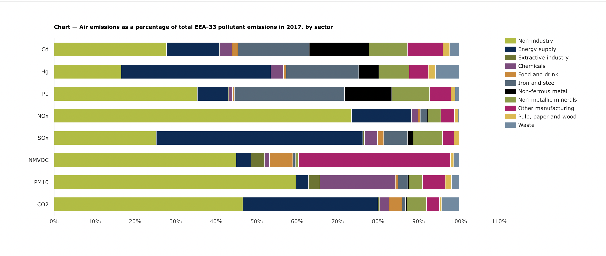

| [home page](https://cmustudent.github.io/tswd-portfolio-templates/) | [visualizing debt](visualizing-government-debt) | [critique by design](critique-by-design) | [final project I](final-project-part-one) | [final project II](final-project-part-two) | [final project III](final-project-part-three) |

# Assignment 3/4 - Critique by design

## Step 1: find a data visualization (with data you can use!)

Source: European Environment Agency - https://www.eea.europa.eu/data-and-maps/daviz/air-emissions-as-a-percentage-3#tab-chart_3

Notes: 
EEA-33 refers to the 33 member countries of the European Environment Agency including the EU-28 Member States, the four European Free Trade Agreement countries (Iceland, Liechtenstein, Norway and Switzerland) as well as Turkey. 
The dataset does not contain data for Turkey and Norway.
The data shows Air emissions for 8 polutants as a percentage of total EEA-33 pollutant emissions in 2017, by sector

Why did I choose this visualization? 

Air pollution has been a major concern in my country (Pakistan) in the past few years. We have consistently had poor air quality especially in the big cities and the phenomenon of "smog" has become a common occurence for my city Lahore. This year in particular Pakistan faced a climate catastrophe with the 2022 Floods which left almost one third of the country submerged in water. While a lot needs to be done in Pakistan to counter the climate change, Pakistan contributes less than 1% in global emissions and yet it is one of the countries most at risk due to climate change and global heating. While I would've liked to use something more relevant to Pakistan, this visualization caught my attention where the European Environment Agency is trying to play a role to counter the climate challenges and highlighting important environmental data around pollutants through their many visualizations available on their website. It would be useful for Pakistan as well to have effective policy making based on data to reduce the climate catastrophes in the future. 

## Step 2: critique the data visualization

The visualization was showing relevant information in terms of the air emissions for EEA-33 by each sector however there was too much colour and poor perceptibility, engagement and intuitiveness. The aesthetics could have been greatly improved to give the readers a better understanding. 

What worked?

The visualization does a good job of showing all different air emission pollutants and uses a stacked bar chart to show the percentage contributed by each source. The good thing was you can get a quick idea of which sectors are producing the highest levels of emissions. 

The heading, legend and notes provide relevant information needed to interpret the chart. 

The chart uses a concise format to represent a lot of information. It is showing 8 different pollutants and percentages from 11 different sources. Such a chart has great usefulness for several environment control purposes. 

While the chart might be hard to interpret just by looking at it, if you hover over a single bar, it gives the breakdown of numbers from each source thus increasing the usability of the chart. 

What didn’t work?

The chart is using a lot of distracting colors, with some sources having similar colors. 

While it might be easy to compare the larger chunks of color, it is hard to compare the sources that are contributing less. 

It took me sometime to understand that the chart is showing total 100% emissions and then what percentage of each emission is coming from a particular source. While this is written in the heading, the reader can get lost in the information while looking at the chart. 
The x-axis shows percentages but when you hover over the graph it shows the same numbers as decimals which further adds to the confusion. The x-axis also shows 110% which is misleading and unnecessary (seems to be just a designing error). 

It is also hard to compare a single industry and see how much pollution it is causing. There is a lot of eye travel required in the chart and you constantly have to keep the colors for each sector in mind. 

The way the information is presented in terms of percentages also makes it hard to compare the pollutants with one another as it is showing the total 100% of the emissions of that pollutant but not the actual amount that is released. For example, from this chart you cannot tell whether there are greater emissions for CO2 or SOx which is critical information for the audience looking at this topic and thus reduces completeness and usefulness.

What would you do differently?

-	I would have used a grid a of bar charts (or pie charts or bubble charts) to show each pollutant separately, so it is easier to understand. 
-	I would want to give a message out of this chart that is obvious in the heading for example “Energy Sector is the highest source of air emissions for most pollutants”. Through this I would keep the other low emission causing sectors greyed out and highlight this particular sector. This would also reduce the distracting colors in the chart and make it more appealing to the eye.
-	I would keep the numbers consistent, either use decimals or percentages.
-	If the data was available, instead of showing total 100% I would show the amounts of emissions caused by each sector and then the total emissions for the pollutant. This would make it easier to compare the individual sectors and pollutants with one another.

## Step three: sketch out a solution

Keeping the things mentioned in the previous section in mind, I made the following sketch for a possible redesign. 

Here I have used a grid of bar charts, with emphasis on the energy sector as it is the source contributing to major chunk of pollutnats. I have kept the all other industries in grey colour to reduce the distracting colours. The non-industry sector is technically the highest contributor but I have also removed emphasis from that so we can focus primarily on the industry sectors as that is what this chart is trying to compare. 

I tried some other possible ways of visualizing this data as well as shown below. 

However after comparing all the possible options I thought that the grid of bar charts was the most appropriate option. 

