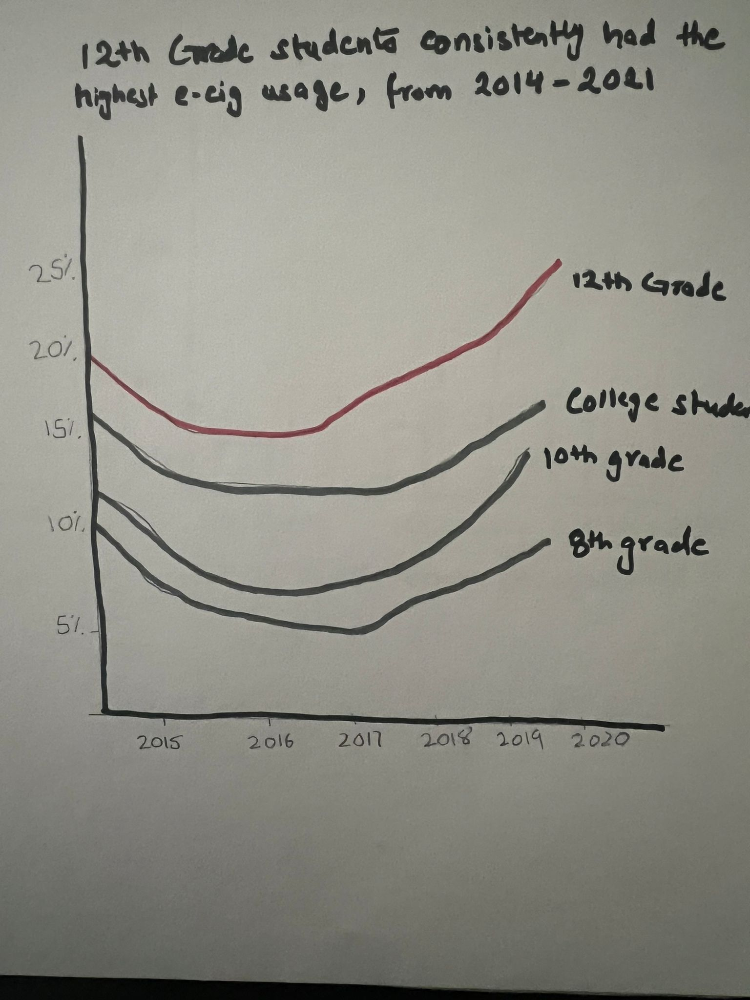
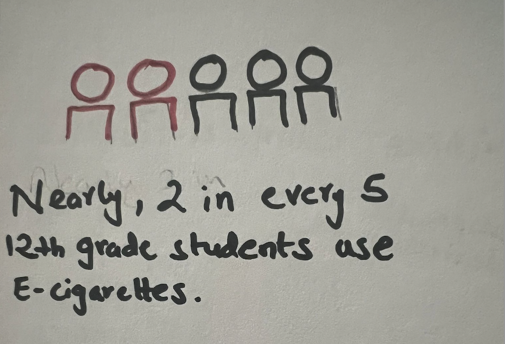
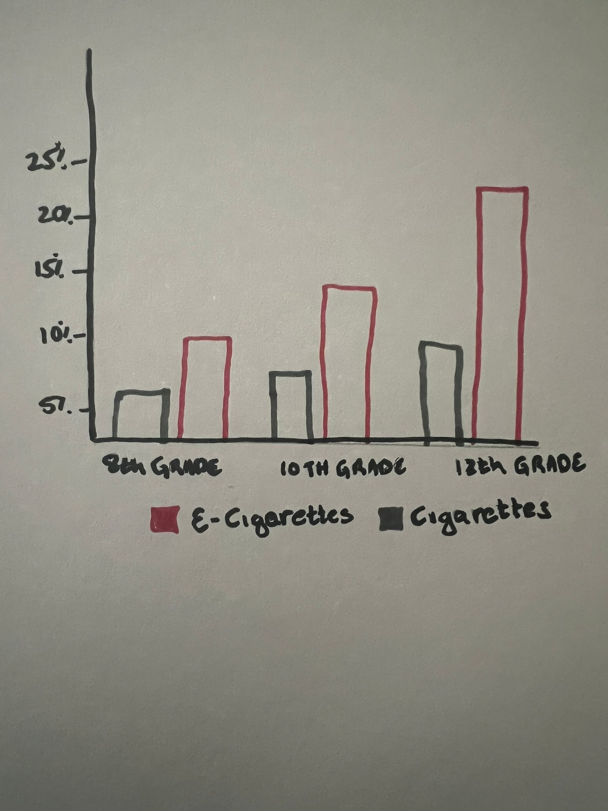
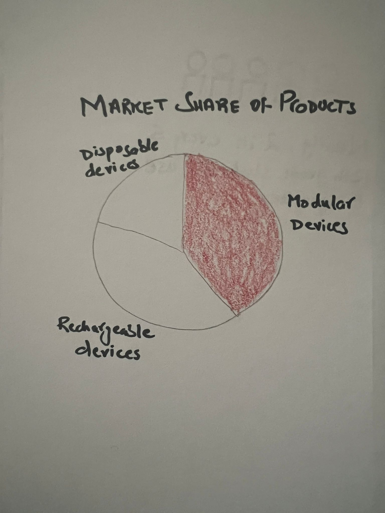

| [home page](https://mahnoorayub.github.io/Mahnoor-Portfolio/) | [visualizing debt](visualizing-government-debt) | [critique by design](critique-by-design) | [final project I](final-project-part-one) | [final project II](final-project-part-two) | [final project III](final-project-part-three) |

# Project Part 1 

## The Rise of of Electronic Cigerrates in the US

### Background

The landscapee for tobacco products has continued to evolve to include several different types of tobacco items including including smoked, smokeless, and electronic products. Such e-cigarettes famously referred to as vapes have now become the most commonly used tobacco product amoung the U.S youth. These e-ciggerates come in a variety of different flavours, can be disposable or non-disposable and most often contain nicotine that is a highly addictive chemical. The rapid increase in vaping during the past decade has aroused public health concern, recently heightened by potential links between vaping and acute lung injuroes.

E-cigarettes entered the U.S. marketplace around 2007, their use among U.S. middle and high school students increased 900% during 2011-2015, before declining for the first time during 2015-2017. Data from the 2022 annual National Youth Tobacco Survey showed that 14.1% of high school students and 3.3% of middle school students said they'd recently used an e-cigarette or other vape product. [source](
https://www.cdc.gov/tobacco/data_statistics/surveys/nyts/data/index.html) 

The purpose of this project is to examine the use of e-cigarretes in the US, understanding the rise over the years, the demographics of the users, the frequency of use and the most commonly used brands/products. I will also try to show the effects certain policies such as the banning of JUUL might have had on the usage of these products. 

Examining these features can help policy makers take effective actions to regulate the use of e-cigarrets and vapes. 

### Initial Sketches 

I have created some initial sketches to present the various trends I want to show. 

The first sketch is showing a line graph that depicts how the usage for e-cigarettes first declined between 2015-2017 after which we see a rise again. The highest usage can be seen among the 12th grade students. 

The following visualization shows the prevalence on the use of E-cigarettes among the 12th graders to show the urgency as nearly 2 out of every 5 12th graders say they have used a similar product over the past year. 

The following bar-chart shows the comparison of what the users are mostly smoking with these e-cigarettes, whether they contain nicotine, marijuana or just flavouring. We can see the highest percentage is for nicotine which is concerning as it leads to addiction. 

.jpeg)

Next we have a bar-chart showing the comparison of use between cigarettes and e-cigarettes among the US youth. As we can we the use of e-cigarettes is comparitively much higher for all groups. 

Lastly I have a pie-chart showing the market share of the type of products. These e-cigarettes come in various different forms with the main ones being modular, rechargeable or disposable devices. We can see that the modular devices have the highest market share.

These are some of the initial sketches and I as play around with more data I will create subsequent visualizations that are in line with my story and analysis. 

### Data Sources

#### 1.) FDA Annual National Youth Tobacco Survey

The National Youth Tobacco Survey (NYTS) datasets are available for public use from the year 1999 - 2021. Items measured as part of the NYTS survey include correlates of tobacco use such as demographics, minors’ access to tobacco, and exposure to secondhand smoke. The data can be accessed [here](
https://www.cdc.gov/tobacco/data_statistics/surveys/nyts/data/index.html) 

#### 2.) Center of Disease Control and Prevention 

CDC provides relevant statistics around prevalence of current (past 30-day) e-cigarette use, overall and by selected characteristics and school level. The data can be accessed [here](https://www.cdc.gov/mmwr/volumes/71/wr/mm7140a3.htm?s_cid=mm7140a3_w)

#### 3.) Monitoring the Future Survey
Data from the monitoring the future surveys shows results from nationally representative samples of 12th-, 10th-, and 8th-grade students responses who received questions on nicotine vaping. The data can be accessed [here](https://www.nejm.org/doi/full/10.1056/NEJMc1910739)

### Method and Medium 

For the purpose of this project I would primarily be using shorthand to create my story. My story would include line graphs (to show trends over time), bar charts (for comparisions across demographics and products) and some other visualizations as shown in my sketches. I will build these primarily using Tableau or Flourish depending on which platform provides better visualizations for the ideas I have in mind. I will also be using Excel for some data cleaning and merging purposes so I can have all the relevant data that I need and in the correct formats. 
